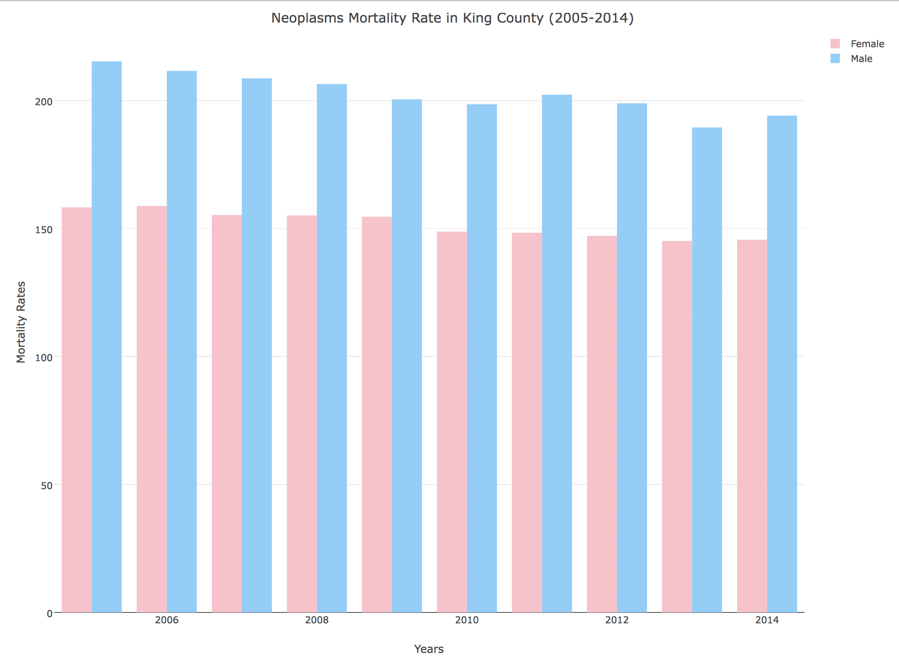

# エクササイズ1

このエクササイズでは `plotly` というライブラリを用いてインタラクティブなデータ可視化について学んでいきます。今回扱うデータセットは[IHME](http://www.healthdata.org/)から取得出来るデータセットで、ワシントン州キング群のガンによる死亡率を可視化していきます。今回のエクササイズで可視化するグラフは以下の図のようになります。

このエクササイズは、`exercise-1/exercise.R`に記載されていますので、そちらの指示に従って下さい。
