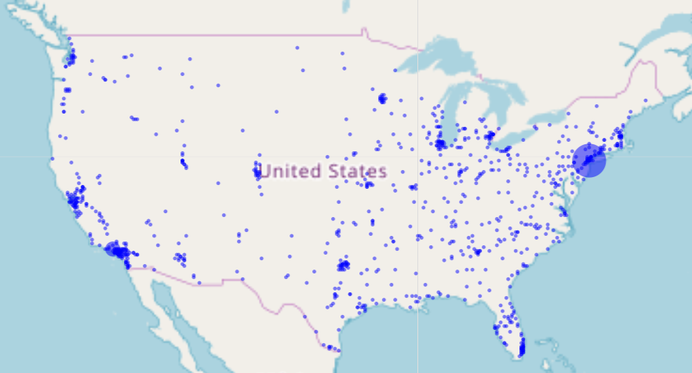

# エクササイズ3

このエクササイズでは `leaflet` というライブラリを用いてインタラクティブな地図の可視化について学んでいきます。今回扱うデータセット[simplemaps.com](https://simplemaps.com/data/us-cities)から取得出来るデータセットです。今回のエクササイズで可視化するグラフは以下の図のようになります。

このエクササイズは、`exercise-3/exercise.R`に記載されていますので、そちらの指示に従って下さい。
