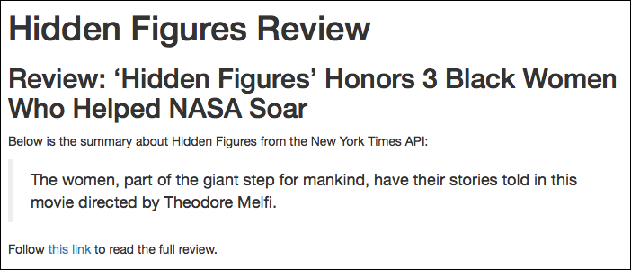

# エクササイズ1

このエクササイズでは`R Markdown`を用いてデータ分析の結果をレポートとしてまとめていく方法を学びます。今回扱うデータセットは[New York Times API](https://developer.nytimes.com/)から取得出来る映画のレビューデータになります。今回のエクササイズで作成するレポートは以下の図のようになります。



このエクササイズでは複数のファイルを作成したり編集したりする必要があります。
今回、レポートを作成する手順は以下の通りになります。

## 1. データラングリング

New York Times APIから映画のレビューデータをダウンロードするにはスクリプトを実装する必要があります。スクリプトの実装方法は `exercise.R` ファイルに書かれているコメントに従って実装して下さい。ちなみにこのデータラングリングは第１４章のエクササイズ2で実施している内容と同じになりますので、既に実施した方はそのスクリプトを再利用して下さい。

APIキーを取得するためにはこちらのURL **<https://developer.nytimes.com/accounts/create>** のフォームを入力してサインアップして下さい。サインアップが完了すると登録したメールアドレスにAPIキーが送付されます。

APIキーを取得したら `apikey.R` にAPIキーを保存しておいて下さい。`apikey.R` のファイルの中身は以下のようにして下さい。

```r
nty_apikey <- "my-api-key-as-a-string-inside-quotes"
```

`.gitignore` ファイルに `apikey.R` を追加するのを忘れないようにしましょう！

## 2. R Markdownファイルの作成

続いて、このディレクトリで新規にR Markdownファイルを作成しましょう。作成したファイルのファイル名は **`index.Rmd`** として下さい。また、ファイルのタイトルは _"Movie Review"_ として下さい。

## 3. データの設定

`index.Rmd`ファイルにおいて、`source()`を用いて`exercise.R`のデータラングリングの結果をロードして下さい。


## 4. マークダウンコンテンツ

R Markdownの構文を用いて、映画のレビューのヘッドラインをセカンドレベルのヘッダとして表示して下さい。また、レビューの要約をブロッククオートで表示して下さい。また、`link`という名前のコードチャンクを作成し、`link_markdown`という変数に映画のレビュー全文が記載されているウェブサイトへのハイパーリンクを代入して下さい。続いて代入したハイパーリンクをR Markdownの本文で表示して下さい。

