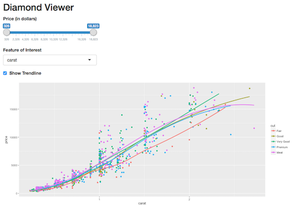

# エクササイズ3

このエクササイズではユーザインターフェース（UI）関数とサーバ関数を定義してShinyアプリを作成します。今回作成するShinyアプリでは、分析対象のデータセットは `diamonds` データセットで、どのような特徴がダイヤモンドの価格に影響を与えるかをインタラクティブに調査出来ます。今回作成するアプリのUIは以下のようになります。

このエクササイズの詳細は、 `exercise-3/app.R` に記載されていますので、そちらの指示に従って下さい。
