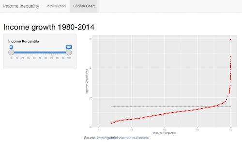

# エクササイズ4

このエクササイズでは複雑なレイアウトや要素を持つShinyアプリを作成します。今回作成するアプリのUIは以下のようになります。

このエクササイズの詳細は、 `exercise-4/app.R` と `exercise-4/app_ui.R`に記載されていますので、そちらの指示に従って下さい。`exercise-4/app_server.R` の中にはサーバ関数が既に定義されているので、サーバ関数を開発する必要はありません。

