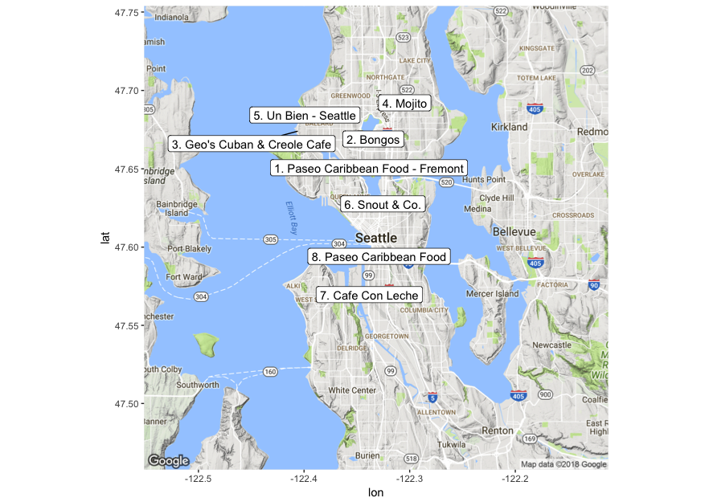

# `APIs` in Action: シアトルのキューバレストラン

このセクションでは、[Yelp Fusion API](https://www.yelp.com/developers/documentation/v3)を用いて

> _“シアトルで最高のキューバレストランはどこか?”_

という問いに答えていきます。

この問いに答える中で、APIにデータをリクエストし、リクエスト結果を処理/分析する方法を学んでいきます。

**注意点** [analysis.R](analysis.R)を実行するには[Yelp API](https://www.yelp.com/developers/documentation/v3/authentication)と[Google Maps API](https://developers.google.com/maps/documentation/geocoding/get-api-key)の2つのAPIキーを取得する必要があります。これら2つのAPIキーを取得したら、[api_key.R](api_key.R)に保存するようにして下さい。

このセクションではYelp APIから取得するデータを利用して、以下に示す画像のようなシアトルのキューバレストランの地図を作成します。一点注意してもらいたいのは、この地図は過去に作成されたものなので、現状のYelpの評価を反映していない場合があります。

