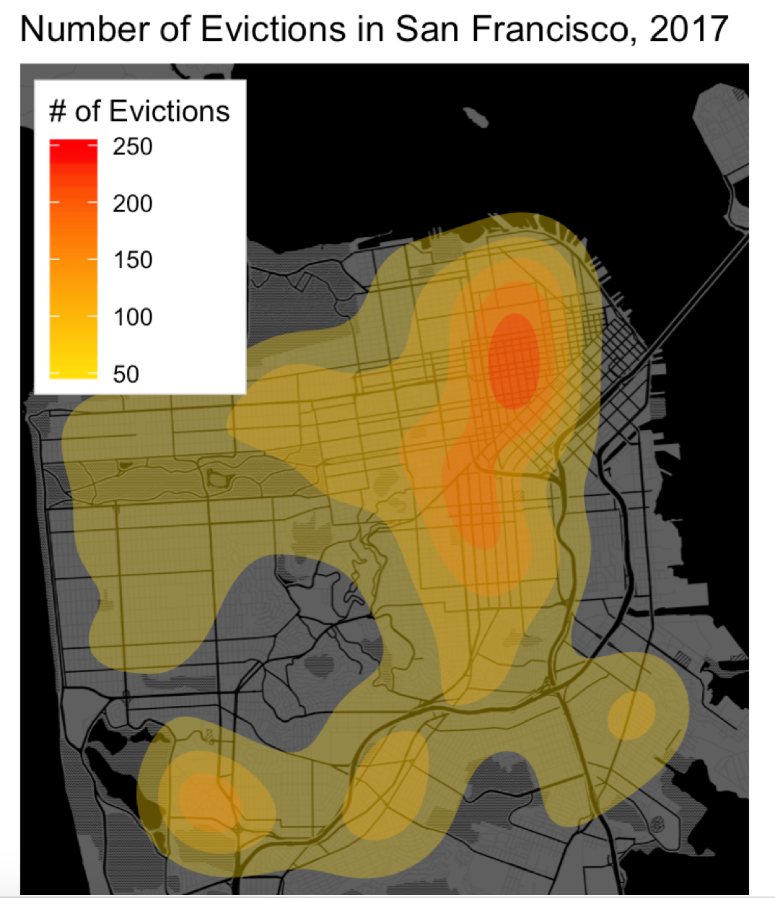

# `ggplot2` in Action: サンフランシスコでの立ち退きの可視化

このセクションでは[立ち退きデータ](https://catalog.data.gov/dataset/eviction-notices)を用いてサンフランシスコの立ち退きを可視化していきます。

**注意点** [analysis.R](analysis.R)を実行するには[Yelp API](https://www.yelp.com/developers/documentation/v3/authentication)と[Google Maps API](https://developers.google.com/maps/documentation/geocoding/get-api-key)の2つのAPIキーを取得する必要があります。これら2つのAPIキーを取得したら、[api_key.R](api_key.R)に保存するようにして下さい。

このセクションではサンフランシスコの立ち退き命令を以下の画像に示すように可視化していきます。可視化に用いるコードは[analysis.R](analysis.R)になります。

