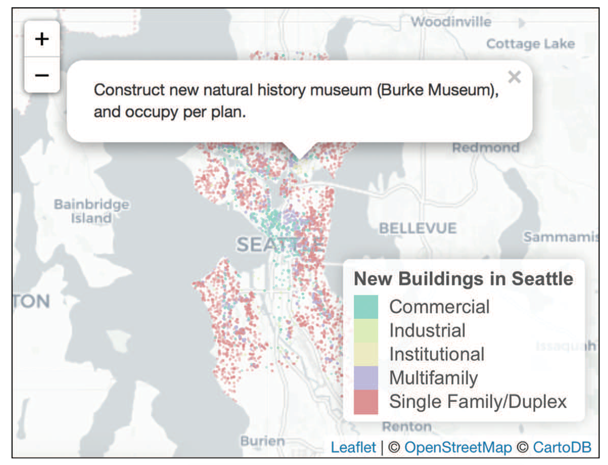

# Interactive Visualization in Action: シアトル市の変化を探る

このセクションではシアトルの[建設許可データ](https://data.seattle.gov/Permitting/Building-Permits/76t5-zqzr)を用いてシアトルの変化を可視化していきます。

このデータ可視化では[Plotly](https://plot.ly/r/)や[Leaflet](https://rstudio.github.io/leaflet/)といったパッケージを用いて以下の画像に示すようなインタラクティブなデータ可視化を実現していきます。

