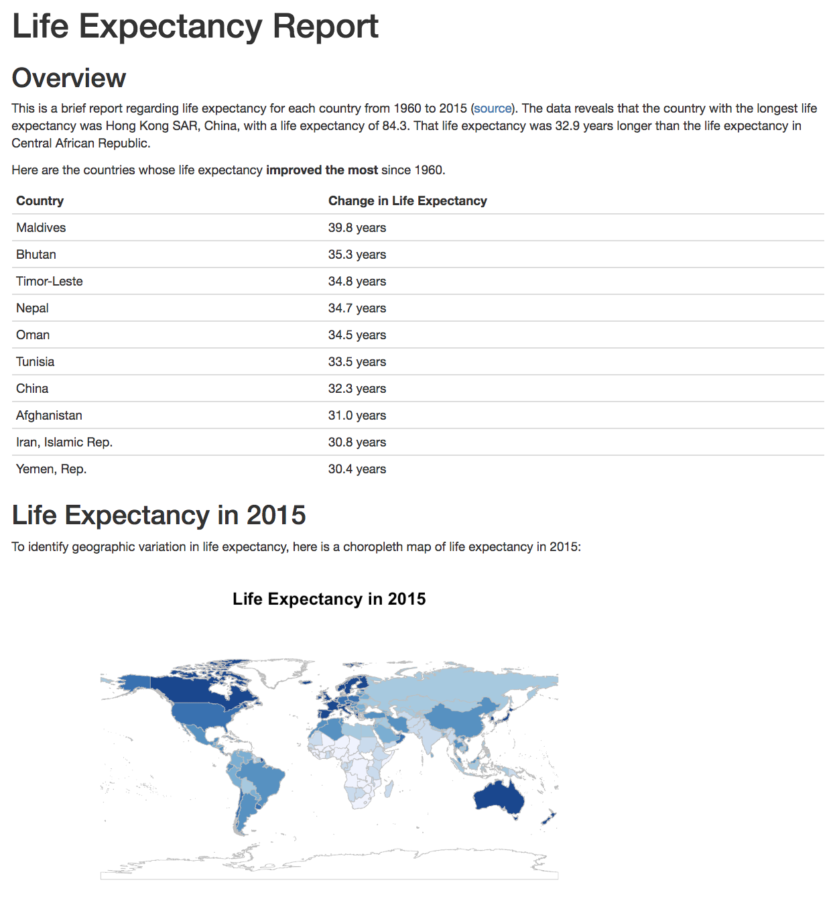

# R Markdown in Action: 寿命に関するレポート

このセクションでは各国における1960年から2015年の寿命に関するレポートを作成していきます。このレポート作成で使うデータセットは[世界銀行](https://data.worldbank.org/indicator/SP.DYN.LE00.IN)からダウンロード出来ます。このセクションを通してドキュメントをウェブ上で共有する方法を学んでいきましょう。

レポートを作成するコードを綺麗に管理するために、このレポートは二つのファイルで構成されています。
 
- [`analysis.R`](analysis.R): データ分析用のスクリプトで、分析結果を変数に代入する。
- [`index.Rmd`](index.Rmd): ファイルの内部で`source()`を用いて`analysis.R`を実行し、分析結果を変数に代入しレポートを作成する。

R言語の`knit()`を用いて[`index.html`](index.html)を生成しています。[`index.html`](index.html)のスクリーンショットは以下のようになります。

