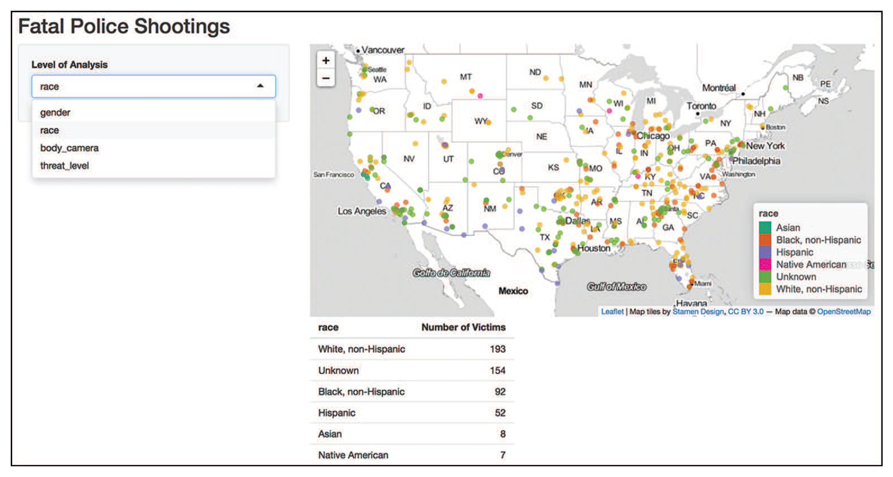

# Shiny in Action: 警官の発砲に関する可視化

このセクションでは2018年の上半期（1月～6月）に米国で警官に射殺された人々のデータセットを可視化するShinyアプリケーションを構築します。

データセットをまとめたのは[ワシントン・ポスト紙](https://www.washingtonpost.com/graphics/2018/national/police-shootings-2018/?utm_term=.d5d3a88f97da)で、[GitHub](https://github.com/washingtonpost/data-police-shootings)に公開されています。

[add_lat_long.R](add_lat_long.R)を用いて元データに緯度/経度を付与しています。ただし、[分析対象のデータセット](./data/police-shootings.csv)には既に緯度/経度が付与されていますので、[add_lat_long.R](add_lat_long.R)を実行する必要はありません。

**注意点** スクリプトを実行するには[Google Maps API](https://developers.google.com/maps/documentation/geocoding/get-api-key)が必要になります。

Shinyアプリケーションは[`app.R`](app.R)スクリプトに記載されています。このアプリを実行するにはR Studioで _Run App_ ボタンを押して下さい。アプリのスクリーンショットは以下の通りになります。

