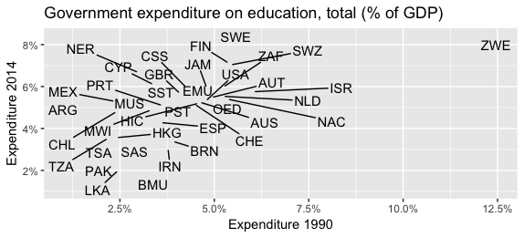
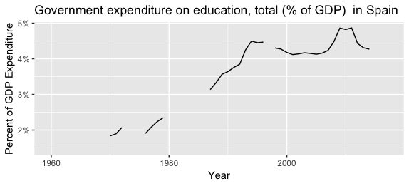
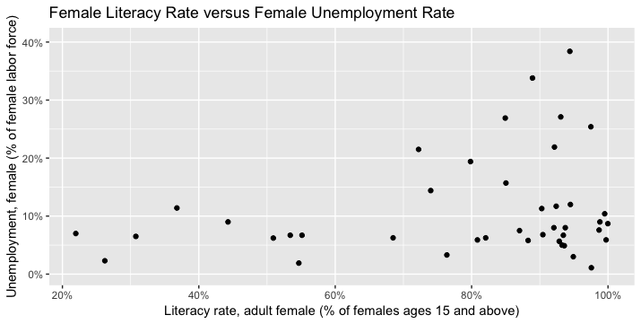

# `tidyr` in Action: 教育統計データの可視化

このセクションでは `tidyr` を用いて実際のデータを整形していきます。このセクションを通してデータの整形がデータ分析において重要なプロセスであることを学びます。このセクションで扱う[データ](data/)は[World Bank Data Explorer](https://data.worldbank.org/)からダウンロードしたものです。[World Bank Data Explorer](https://data.worldbank.org/)には各国のたくさんの経済/社会指標が記録されています。

特にこの例では各国の[教育指標](http://datatopics.worldbank.org/education/)を扱っていきます。教育指標の例としては、政府の教育支出、識字率、就学率などがあります。

このセクションでは以下の画像に示すように教育統計データを可視化していきます。可視化に用いるコードは[analysis.R](analysis.R)になります。

## 各国の教育支出を1990年と2014年で比較

## スペインにおける教育支出の推移

## 各国における女性の識字率と失業率の関係

